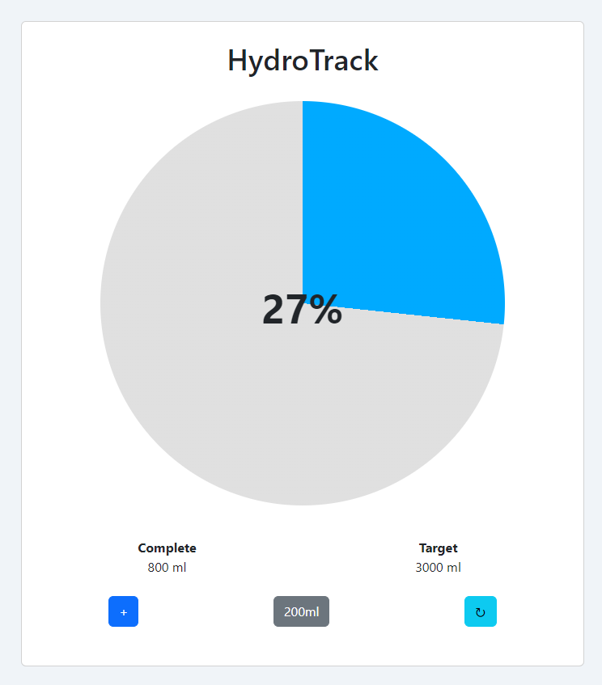

# Hydration

Water intacke tracking web app.

## Features

- **Set Daily Goal:** Easily set your daily water intake goal.
- **Log Water Intake:** Log the amount of water you drink throughout the day.
- **Progress Tracking:** Visualize your progress with a dynamic pie chart.

## Usage

1. **Set Daily Goal:**
   - Click on the "Target" text to open the dialog window.
   - Enter your daily water intake goal in milliliters and save the changes.

2. **Log Water Intake:**
   - Click the "+" button to log a 200ml water intake.
   - The pie chart and progress text will update accordingly.

3. **View Progress:**
   - Monitor your progress with the dynamic pie chart.
   - View the complete amount and target amount of water intake.

### License 

MIT